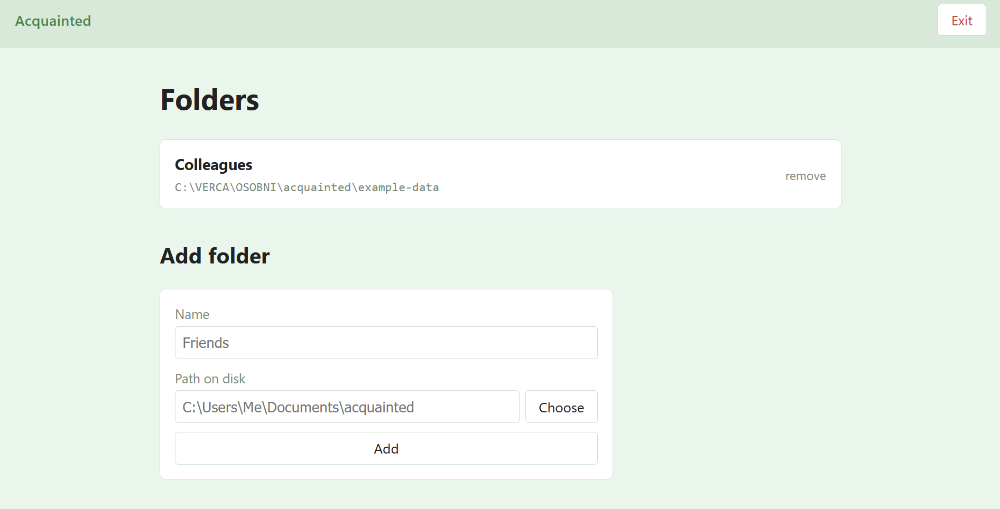
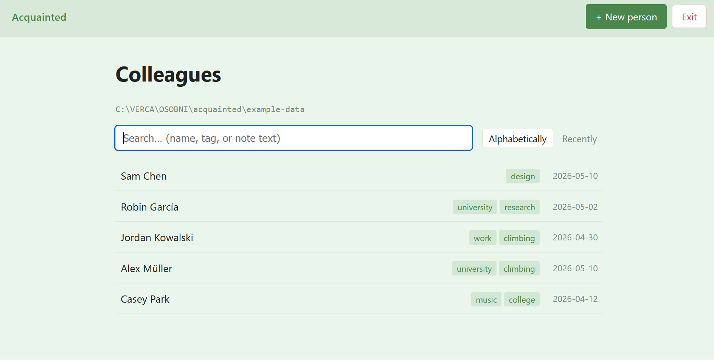
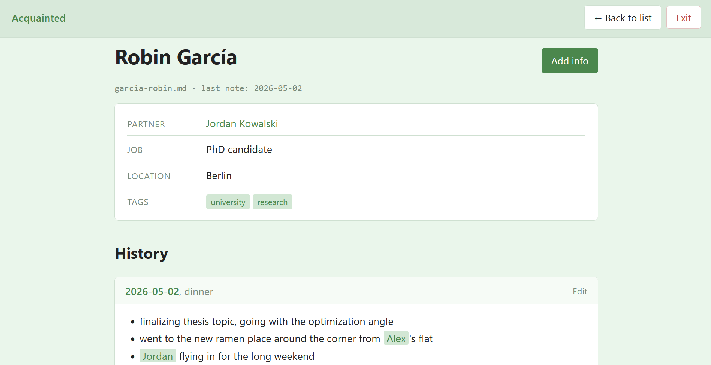

# Acquainted

A small local web app for keeping semi-structured notes about friends and colleagues. Each person is one Markdown file with YAML frontmatter (current facts) and a dated timeline of encounter notes (history). Files stay readable in any Markdown editor — Obsidian on the phone keeps working unchanged.

The app's job is to make updating fast: open someone's page after meeting them, change a field or jot a note, and the app auto-logs what changed under the date you pick.

*Built with assistance from [Claude Code](https://claude.com/claude-code).*

## Privacy and disclaimer

The app is designed to run **only on `127.0.0.1`** (localhost) — don't expose your local `.md` files with sensitive information to your network or the internet. Keep the bind address as-is and don't open port 5000 in your firewall. Nothing is uploaded anywhere by the app itself.

You're storing notes about real people, so treat the data accordingly:

- **Don't paste it into LLMs or other cloud services.** That includes asking an AI to summarize, search, or "clean up" your notes — anything fed to a remote model leaves your machine and may be retained by the provider.
- **Mind who else can read your disk.** Encrypted home directory, locked screen when away, the usual file-system hygiene.
- **Try it out with a throwaway folder first.** Point a new location at e.g. `C:\Users\Me\Documents\acquainted-test` and play with creating, editing, and deleting people there before pointing the app at your real notes.

This is a personal-scale tool released as-is. The author provides no warranty and accepts no liability for any loss, damage, or privacy harm arising from its use. See `LICENSE` for the full terms.

## Screenshots

**Welcome screen** — saved folders, plus the form for adding a new one (path can be typed or picked with the native Windows folder dialog).



**List view** — people sorted by surname (diacritics folded, so `García` and `Müller` sort cleanly). Tags and last-note dates show at a glance; the search box does full-text across notes.



**Person page** — briefing card up top (linked partners are clickable), then a reverse-chronological history. `@`-mentions render as inline pills that jump to the mentioned person's page.



## For users

### Requirements

- Windows
- Python 3.10 or newer on `PATH` (test with `python --version` in `cmd`)

### Running the app

- Double-click `run.bat`. First launch creates a `.venv` and installs deps (~30s); after that it starts instantly.
- The browser opens to `http://127.0.0.1:5000/`.
- Stop the server by clicking the red **Exit** button in the top bar (or just close the console window).

### Adding a folder

- On the welcome screen, click **Choose** to pick a folder with the native Windows folder picker (it has its own *New Folder* button), or type a path. Missing folders are auto-created.
- Saved locations live in `app/config.json`; you can add as many as you want and remove them later.

### Adding a person

- Click **+ New person**, fill in the display name. A live preview shows the filename that will be used — diacritics are folded to plain ASCII (`Müller` → `muller.md`).
- Override the filename if you want; `.md` is appended automatically. All other fields are optional.

### Logging a note

- Open someone's page, click **Add info** to switch to edit mode.
- Type your note in the textarea — each non-empty line becomes a bullet. **Tab** / **Shift+Tab** indent and dedent by 4 spaces for nested bullets.
- Pick a **Date** (defaults to today; you can backfill or post-date) and an optional **Type** (free text, ends up in the heading: `## 2026-05-05, call`).
- Any changes to Name / Partner / Job / Location / Tags get auto-logged as bullets under the same heading (e.g. `- partner: +Sam`).
- `last-met` shown in the briefing only bumps forward — backfilling an older meeting won't clobber a more recent one.

### Editing or deleting a past note

- Each date card on the timeline has its own **Edit** button. Use it to fix typos, change the date or type, or delete the section entirely.
- Changing the date relocates the section so the timeline stays in reverse-chronological order.

### Tags

- Comma-separated. Below the input, existing tags in the folder appear as clickable chips — click to append (case-insensitive dedup).
- Available on both the new-person form and edit mode.

### Mentioning other people in a note

- Type `@` followed by a few letters. A dropdown shows matching people in the same folder.
- **↑/↓** navigate, **Enter** or **Tab** insert, **Esc** dismiss.
- The inserted text is a markdown link using the person's first name (`[Alex](muller-alex.md)`); clicking it in the rendered timeline jumps to their page.

### Partners

The Partners field accepts **multiple people**, comma-separated. Click **+ Add** to open the picker; each click appends a partner (you can also just type names directly).

- **Picked partners are linked both ways.** When you save, the app silently adds you to that person's partner list too — no note bullet on either side.
- **Removing a linked partner cascades.** If you remove someone you previously picked, they're removed from your file *and* their file. A confirmation popup warns you before the save goes through.
- **Renaming yourself propagates.** Existing backlinks update to your new display name on next save.
- **Typed-but-unpicked names** (people not in the folder) stay as plain text — no link, no backlink.
- **Existing single-partner files don't need migration.** YAML stays as `partner: Sam` until you actually add a second partner, at which point it switches to a list. Files you've edited only in Obsidian still load fine.

### Searching

- The search box does a full-text scan across all files in the folder when you press Enter.
- Results split into *Matches in name or tag* and *Matches in notes* (with up to 3 highlighted snippets per person).

### Sorting

- **Alphabetically** by surname (diacritics folded for ordering — `Müller` sorts as `muller`).
- **Recently** by `last-met` descending.

### File format

```markdown
---
display-name: Alex Müller
partner:
  - Sam
  - Robin
partner-file:
  - chen-sam.md
  - garcia-robin.md
job: Acme Corp full-time
location: Berlin
tags:
  - university
  - climbing
last-met: '2026-05-04'
---

## 2026-05-04, call
- partner: +Robin
- talked about the upcoming trip

## 2026-02-15
- new partner, Jordan
- moved out of the city
```

- One file per person, named `surname-given.md` (lowercase, ASCII-folded).
- Section headings use `## YYYY-MM-DD` or `## YYYY-MM-DD, <type>`. The app only writes/edits these sections; everything else in the body is preserved verbatim.
- New sections are inserted in reverse-chronological order; same-date sections stack with the newest at the top.
- `partner` and `partner-file` are **parallel lists**. The app keeps them aligned: `partner-file[i]` is the canonical link, `partner[i]` is the cached display name. Files with a single partner write the legacy scalar form (`partner: Sam`) to stay friendly to manual editing in Obsidian; multi-partner files use list form.
- Frontmatter keys outside the fixed schema are preserved on save (you can add your own).

### Editing in Obsidian alongside the app

Safe to do — the app reads the file fresh on every page load and only inserts into the chosen date's section on save. Your manual additions to other sections survive untouched.

The one edge case: if you have the person's page open in edit mode in the app **and** edit the same person's frontmatter in Obsidian before clicking Save, the app's save will overwrite the frontmatter with whatever the form has. Reload the page in the app (or click Cancel and re-open Add info) to pick up Obsidian-side frontmatter changes before editing.

## For developers

### Stack

- **Flask 3** + Jinja2 templates (server-rendered HTML, small inline vanilla-JS for the partner picker, tag-chip clicks, Tab-indent in the textarea, `@`-mention autocomplete, live filename preview, and inline per-section edit toggles)
- **python-frontmatter** for YAML frontmatter parsing/writing (preserves unknown keys)
- **markdown** for rendering the timeline body to HTML (4-space indent threshold for nested lists)
- **MarkupSafe** for safe `<mark>`-highlighted search snippets
- No database, no JS framework, no build step

### Project layout

```
acquainted/
├── app/
│   ├── app.py              Flask routes + form handling + folder picker
│   ├── config.py           Saved locations (CRUD on app/config.json)
│   ├── storage.py          MD read/write, auto-log diffing, search, slugify
│   ├── static/style.css    All styling (CSS variables for the green theme)
│   └── templates/
│       ├── base.html       Layout, flashes, sticky topbar with Exit button
│       ├── welcome.html    Location picker (with native folder dialog)
│       ├── list.html       Person list + full-text search results
│       ├── person.html     Briefing/edit person page + per-section editing + @-mention JS
│       ├── new.html        New-person form (with live filename preview)
│       └── exit.html       Goodbye page shown after clicking Exit
├── requirements.txt
└── run.bat                 Windows launcher (creates venv, installs deps, opens browser)
```

`app/config.json` is created on first save and not committed.

### Module responsibilities

- **`config.py`** — `list_locations`, `get_location`, `add_location`, `delete_location`. Each location has a deterministic slug derived from its name; collisions get a numeric suffix. `add_location` auto-creates the directory if it doesn't exist.
- **`storage.py`** — the only module that touches `.md` files.
  - `list_people(folder)` reads frontmatter from every `*.md`, skips files without a `display-name`. Sorted by surname via `_surname_sort_key` (last whitespace-separated word, diacritics folded).
  - `load_person(folder, filename)` returns `{header, body, extras}` where `extras` holds any non-schema frontmatter keys to round-trip on save.
  - `save_person(folder, filename, new_header, manual_note, entry_date, entry_type)` diffs old vs new header, appends change bullets + note bullets to the entry-date's section (creating the section if missing, in reverse-chronological order), bumps `last-met` to `max(existing, entry_date)` if anything was logged, and writes the file with frontmatter keys in the canonical order.
  - `split_sections(body)` → `(preamble, [{heading, date, type, content}, …])`, used by `person_view` to render each timeline section as its own card and by `update_section` to find the right section to edit.
  - `update_section(folder, filename, section_index, new_date, new_type, new_content)` replaces a single section's heading + body. Empty `new_content` deletes the section; changing the date relocates it to keep reverse-chronological order; `last-met` is recomputed from the remaining sections.
  - `_apply_partner_backlink(folder, filename, old_partner_files, new_partner_files, my_display_name)` runs after every `create_person`/`save_person`. It computes set-diffs on the partner-file list: newly added refs trigger `_backlink_add` on the other file (appends to its parallel `partner` + `partner-file` lists, dedup by filename); newly removed refs trigger `_backlink_remove` (drops the matching slot from the other file). Surviving refs get a display-name refresh so renames propagate. All updates are silent — confirmation of removal happens in the form JS before submit.
  - `_normalize_partner_list` + `_emit_partner_value` are the read/write helpers for the partner fields: lists with a single non-empty entry serialize as a scalar string (backward-compat with old `partner: Sam` files), zero entries omit the key, two-or-more entries serialize as a YAML list. Reading accepts either shape.
  - `search_in_folder(folder, query)` returns `{primary, body_matches}` for the list-view full-text search. Body matches carry `snippets` — `MarkupSafe.Markup` objects with `<mark>` around matches.
  - `create_person`, `slugify_filename`, `_surname_sort_key` for the new-person and listing flows.
- **`app.py`** — thin Flask layer.
  - `_header_from_form` parses the person form. `partner` and `partner-file` come in as comma-separated strings from the input + hidden field; `_split_csv` returns parallel lists.
  - `_resolve_partner_file` walks the partner-file list per entry: rejects path traversal (`/`, `\`, `..`, non-`.md`), drops refs whose file is missing, and syncs each cached `partner` display-name to the linked file's current `display-name`. Slots that go entirely empty are pruned.
  - `_safe_filename` rejects `/`, `\`, `..`, and non-`.md` filenames.
  - `pick_folder` shells out to PowerShell (`System.Windows.Forms.FolderBrowserDialog`) on Windows so the welcome page's Choose button gets a native folder dialog with a New Folder button. The PowerShell script sets `[Console]::OutputEncoding = UTF8` and the subprocess output is decoded as UTF-8 — without this, Czech diacritics in the chosen path get mangled (the OEM codepage CP852 emits `Í` as byte `0xD6`, which decoded as CP1252 becomes `Ö`).
  - `edit_section` (POST `/folder/<loc_id>/<filename>/edit-section`) accepts `section-index`, `section-date`, `section-type`, `section-content`, and an `action` of `save` or `delete`; delegates to `storage.update_section`.
  - `exit_app` (POST `/__exit`) renders a goodbye page and schedules `os._exit(0)` from a daemon timer thread ~300ms later, so the response is delivered before the process terminates. Drives the **Exit** button in the topbar.
  - PRG pattern: POST → redirect to GET, so refreshing the briefing doesn't resubmit.

### The auto-log algorithm

Implemented in `storage._insert_into_date`:

1. Build the heading: `## YYYY-MM-DD` or `## YYYY-MM-DD, type`.
2. If a line equal to that exact heading exists in the body, find the end of the section (next `## ...` heading or EOF) and insert the new bullets right after the last non-blank line within it. Preserves existing bullets and blank-line styling.
3. Otherwise, find the first existing heading whose date is `<=` the new entry's date, and insert the new section there with blank-line padding. This keeps reverse-chronological order; same-date sections with different types stack with the newest type on top.
4. If no such position exists (entry is older than every existing section), append at the end.

Diff formatting is in `storage._format_change`. Tags and `partner` use a set diff (`+added -removed`) since order in those lists doesn't carry meaning. Other fields use `old → new`; empty becomes `(none)`.

The note textarea preserves leading whitespace, so 4-space-indented lines round-trip into the markdown source as nested bullets.

### Concurrency / safety notes

- The app is localhost-only, single-user. No auth, no CSRF token, no file locking. Don't expose port 5000 beyond `127.0.0.1`.
- A save reads the file fresh, computes diffs, then writes the whole file. If two app windows save the same person concurrently, the second write wins; not worth solving for a personal tool.
- Filenames (including `partner-file`) are validated to reject `/`, `\`, `..`, and non-`.md` extensions. Folder paths from saved locations are trusted (they came from your own welcome-screen input).
- The PowerShell-launched folder picker runs unattended via `subprocess.run` with no shell-string interpolation; the script body is a fixed literal.
- The Werkzeug dev server prints a "Do not use in a production deployment" warning. For a localhost-only single-user tool, that's expected and harmless.

### Adding a new schema field

1. Add the field name to `TRACKED_FIELDS` in `storage.py` (and `HEADER_ORDER` if you want it in the canonical frontmatter order — non-tracked metadata like `partner-file` and `last-met` live there too).
2. Extend `load_person` to normalize the new field, and `_build_meta` to write it.
3. Extend `_header_from_form` in `app.py` and add an `<input>` to `templates/person.html` and `templates/new.html`.
4. The auto-log diffing handles any string field automatically. List-typed fields need a branch in `_format_change` (see how `tags` is done).

### Running outside Windows / dev loop

```bash
python -m venv .venv
.venv/bin/pip install -r requirements.txt
.venv/bin/python app/app.py
```

Then `http://127.0.0.1:5000/`. Flask's `debug=False` is set in `app.py` — flip it to `True` while developing for autoreload + tracebacks in the browser. The folder-picker Choose button is Windows-only (it shells out to PowerShell); on other platforms it returns an error and the user has to type paths manually.
